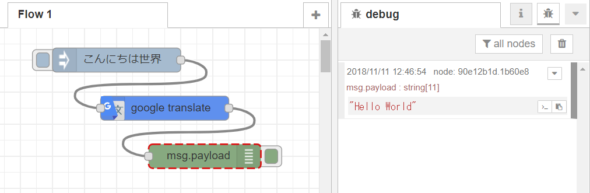
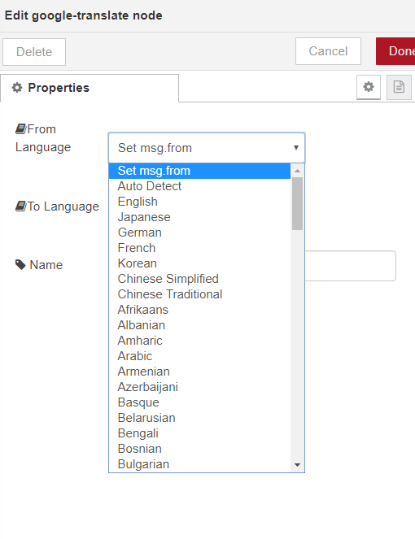

# node-red-contrib-google-translate-fixed
Node-RED node for Google Translate

Based on <a href="https://www.npmjs.com/package/node-red-contrib-google-translate">This package    </a>

Install
-------
Run the following command in your Node-RED user directory - typically `~/.node-red`

        npm install node-red-contrib-google-translate

Example
-------
String data in msg.payload will be translated into language specified in node property.

More than 100 languages are supported in the Google Translate node.

Usage
-------
Translate from German to English. This will result poision.

msg.payload.from = 'en';
msg.payload.to = 'de';
msg.payload.phrase = 'gift';

Language codes
--------------

 'en' English
 'ja' Japanese
 'de' German
 'fr' French
 'ko' Korean
 'zh-cn' Chinese Simplified
 'zh-tw' Chinese Traditional
 'af' Afrikaans
 'sq' Albanian
 'am' Amharic
 'ar' Arabic
 'hy' Armenian
 'az' Azerbaijani
 'eu' Basque
 'be' Belarusian
 'bn' Bengali
 'bs' Bosnian
 'bg' Bulgarian
 'ca' Catalan
 'ceb' Cebuano
 'ny' Chichewa
 'co' Corsican
 'hr' Croatian
 'cs' Czech
 'da' Danish
 'nl' Dutch
 'eo' Esperanto
 'et' Estonian
 'tl' Filipino
 'fi' Finnish
 'fy' Frisian
 'gl' Galician
 'ka' Georgian
 'el' Greek
 'gu' Gujarati
 'ht' Haitian Creole
 'ha' Hausa
 'haw' Hawaiian
 'iw' Hebrew
 'hi' Hindi
 'hmn' Hmong
 'hu' Hungarian
 'is' Icelandic
 'ig' Igbo
 'id' Indonesian
 'ga' Irish
 'it' Italian
 'jw' Javanese
 'kn' Kannada
 'kk' Kazakh
 'km' Khmer
 'ku' Kurdish (Kurmanji)
 'ky' Kyrgyz
 'lo' Lao
 'la' Latin
 'lv' Latvian
 'lt' Lithuanian
 'lb' Luxembourgish
 'mk' Macedonian
 'mg' Malagasy
 'ms' Malay
 'ml' Malayalam
 'mt' Maltese
 'mi' Maori
 'mr' Marathi
 'mn' Mongolian
 'my' Myanmar (Burmese)
 'ne' Nepali
 'no' Norwegian
 'ps' Pashto
 'fa' Persian
 'pl' Polish
 'pt' Portuguese
 'ma' Punjabi
 'ro' Romanian
 'ru' Russian
 'sm' Samoan
 'gd' Scots Gaelic
 'sr' Serbian
 'st' Sesotho
 'sn' Shona
 'sd' Sindhi
 'si' Sinhala
 'sk' Slovak
 'sl' Slovenian
 'so' Somali
 'es' Spanish
 'su' Sundanese
 'sw' Swahili
 'sv' Swedish
 'tg' Tajik
 'ta' Tamil
 'te' Telugu
 'th' Thai
 'tr' Turkish
 'uk' Ukrainian
 'ur' Urdu
 'uz' Uzbek
 'vi' Vietnamese
 'cy' Welsh
 'xh' Xhosa
 'yi' Yiddish
 'yo' Yoruba
 'zu' Zulu